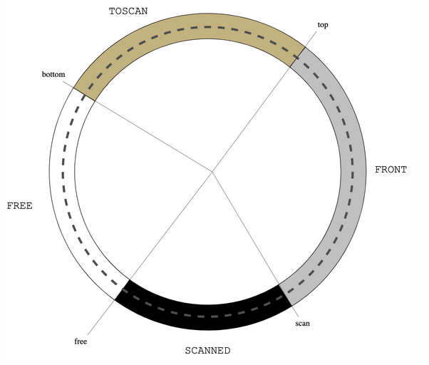
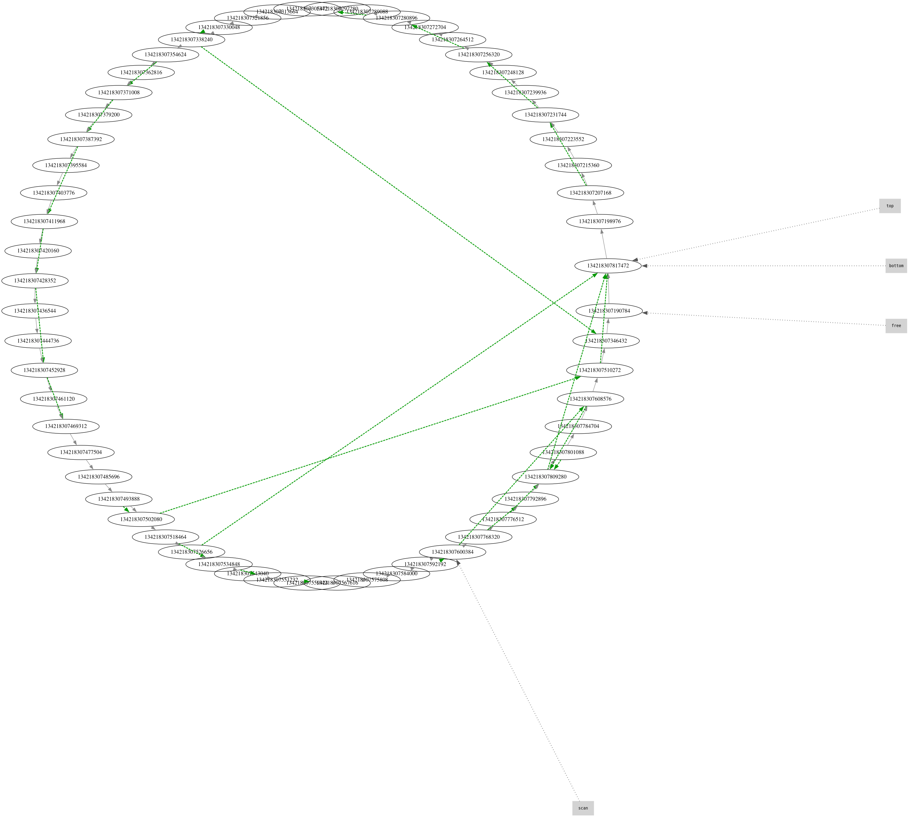
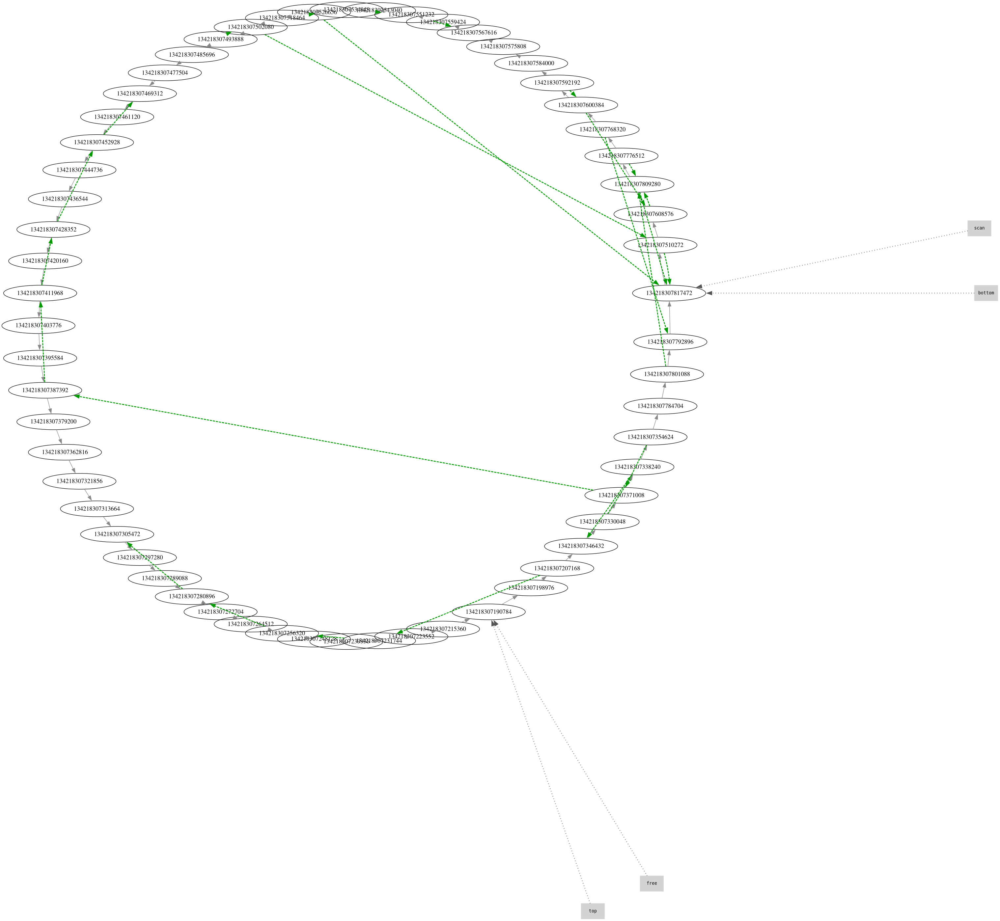

# What's this?

A garbage collector for [Stella](https://fizruk.github.io/stella/) programming language.

# Usage

## Prerequisites

You should have Zig installed. The latest version is mandatory. You can download pre-built binaries from [here](https://ziglang.org/download/).

Then check your version with `zig version`:
```
~  =>  zig version
0.16.0-dev.747+493ad58ff
```

## Running

You can build binary from some `*.stella` files using the `Makefile`:
```
make FILE=<file_name>.stella
```

and then run it:
```
./build/<file_name>
```

> [!NOTE]
> Default build directory is `$(pwd)/build/`

Optionally you can set debug and statistics flags like this:
```
make FILE=<file_name>.stella DEBUG=1 GS_STATS=1 RT_STATS=1
```

Essentially it does three things:
1. `zig build` to build a library, that exports the `gc` function for C, obeying by `gc.h` interface (all runtime dependencies (*.c and *.h) are in `stella/` directory)
2. Compiles Stella file into a C code via docker
3. Links the library with the compiled C code from Stella source code into an executable

## Algorithm

Implements *Treadmill* garbage collector algorithm by Baker.

For references:
- [Baker's paper](https://trout.me.uk/gc/treadmill.pdf)
- [A helpful article](https://cofault.com/treadmill.html)

Whats important is that memory is a double-linked list of objects, divided by 4 pointers.


## Example/demo

With `MAX_OBJECTS` set to 58 just so there is room for the garbage collector to make a `flip` operation, we can see how this algorithm works.

Let's build and run example:
```
make FILE=test-stella/factorial.stella RT_STATS=1 GC_STATS=1 DEBUG=1
echo 3 | ./build/factorial
```

In `state_graph.dot` you can see some graphs of memory during the execution of the program (*if `DEBUG=1` was enabled). Before and after `flip` we can see this:


